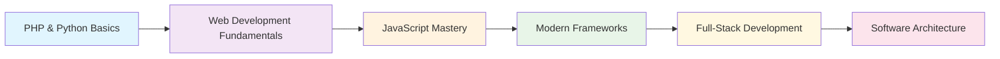

<h1 align="center">
  
</h1>

<h3 align="center">
  
</h3>


---

<div align="center">

## 🛠️ **Technology Stack**


</div>

<table align="center">
<tr>
<td align="center" width="33%">

### **Backend**


</td>
<td align="center" width="33%">

### **Frontend**


</td>
<td align="center" width="33%">

### **Learning**


</td>
</tr>
</table>

---

<div align="center">

## 💡 **Development Philosophy**

</div>

```python
class SoftwareDeveloper:
    def __init__(self):
        self.name = "José Vásquez"
        self.university = "Universidad Nacional de la Amazonía Peruana"
        self.major = "Systems Engineering"
        self.location = "Iquitos, Peru 🇵🇪"
        
        # Core principles
        self.principles = {
            "code_quality": "Clean, readable, and maintainable",
            "learning": "Continuous improvement and adaptation",
            "collaboration": "Effective communication and teamwork",
            "innovation": "Creative problem-solving approach",
            "best_practices": "Following industry standards"
        }
    
    def current_focus(self):
        return [
            "🎯 Mastering modern web frameworks",
            "🏗️ Understanding software architecture",
            "📚 Learning design patterns",
            "🔧 Building full-stack applications"
        ]
    
    def future_goals(self):
        return {
            "short_term": "Complete React & Django projects",
            "medium_term": "Contribute to open source",
            "long_term": "Become a senior full-stack developer"
        }

# Initialize developer instance
jose = SoftwareDeveloper()
print(f"👨‍💻 {jose.name} - Ready to build amazing software!")
```

---

<div align="center">

## 📈 **Learning Roadmap**

</div>

<div align="center">



</div>

<table align="center">
<tr>
<td align="center" width="25%">

**🎯 Current Focus**
- React Components
- Django Models
- API Development
- Clean Code Practices

</td>
<td align="center" width="25%">

**📚 Learning Next**
- Database Design
- Testing Strategies
- DevOps Basics
- UI/UX Principles

</td>
<td align="center" width="25%">

**🔮 Future Plans**
- Microservices
- Cloud Platforms
- Mobile Development
- Team Leadership

</td>
<td align="center" width="25%">

**💼 Career Goals**
- Full-Stack Developer
- Tech Lead
- Solution Architect
- Open Source Contributor

</td>
</tr>
</table>

---

<div align="center">

## 🌟 **Professional Values**

</div>

<div align="center">

| **Principle** | **Description** | **Implementation** |
|:-------------:|:---------------:|:------------------:|
| 🎨 **Clean Code** | Writing readable, maintainable code | Following naming conventions, proper documentation |
| 🔄 **Continuous Learning** | Staying updated with technology | Regular practice, online courses, tech blogs |
| 🤝 **Collaboration** | Working effectively with teams | Clear communication, code reviews, knowledge sharing |
| 🚀 **Innovation** | Finding creative solutions | Exploring new approaches, thinking outside the box |
| ⚡ **Efficiency** | Optimizing performance and productivity | Using best practices, automation, proper tools |

</div>

---

<div align="center">

## 🎓 **Academic Journey**

</div>

<div align="center">

*🏛️ Universidad Nacional de la Amazonía Peruana*  
*📖 Bachelor's in Systems Engineering*  
*📍 Iquitos, Loreto, Peru*  
*🎯 Focus: Software Development & System Analysis*  

*💡 "Learning to transform ideas into digital reality"*

</div>

---

<div align="center">

## 📧 **Let's Connect & Collaborate**

</div>

<div align="center">

[](mailto:jovz9673@gmail.com)
[](https://github.com/jArt352)

</div>

<div align="center">

### **Open to collaborate on:**

🌐 **Web Development Projects** • 💻 **Open Source Contributions** • 📖 **Learning Partnerships** • 🔧 **Code Reviews**

</div>

---

<div align="center">

## 💭 **Philosophy**

</div>

<div align="center">

*"The best code is not just functional, but elegant  
and maintainable. Every line should tell a story,  
and every function should have a purpose."*

*— Building digital experiences from the heart  
of the Peruvian Amazon 🌳*

</div>

---

<div align="center">


</div>
